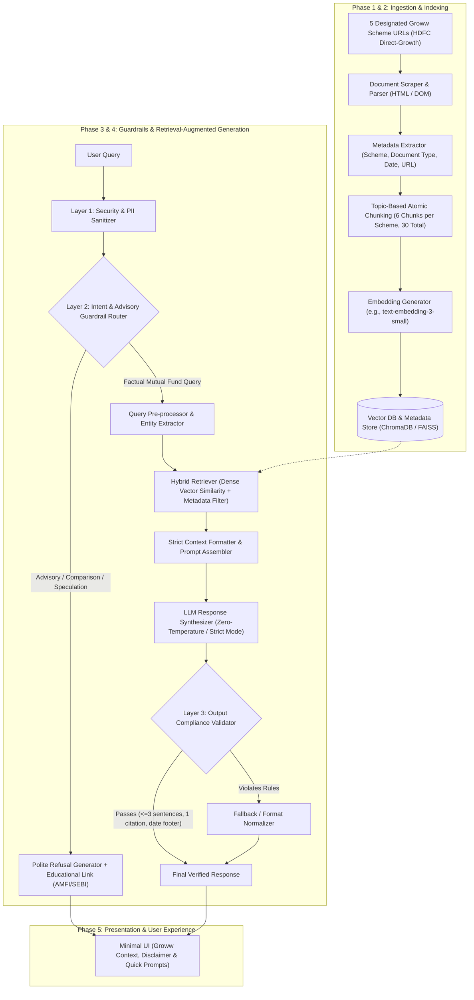
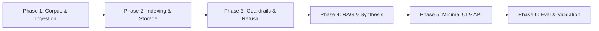
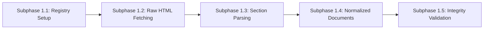
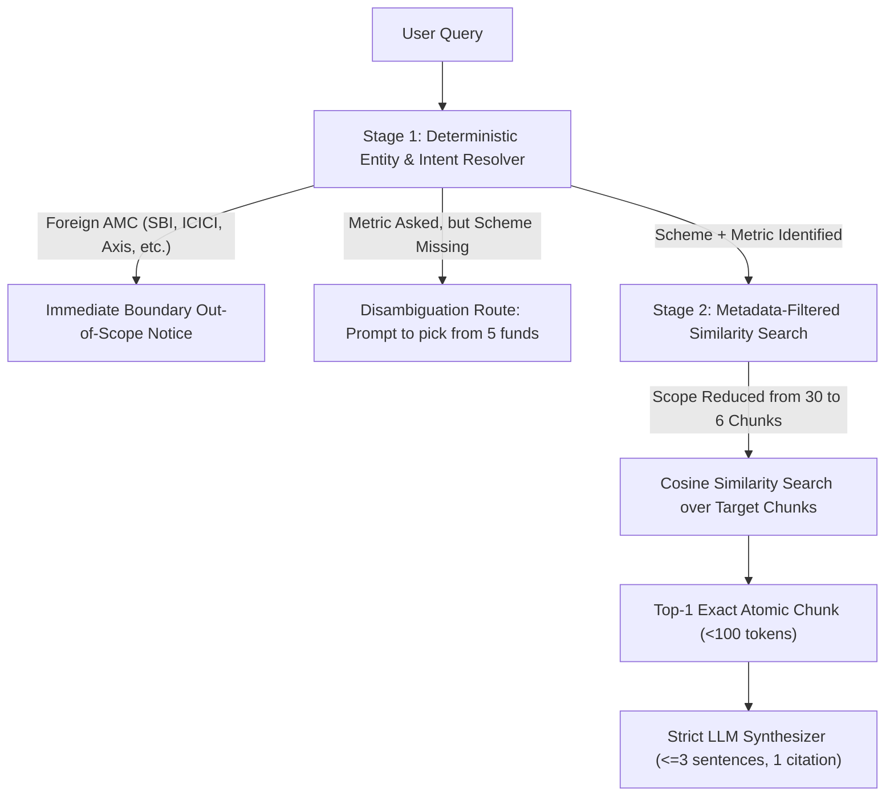
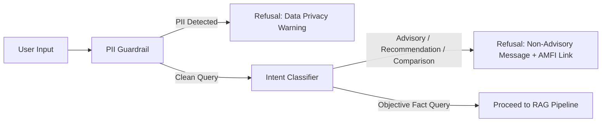
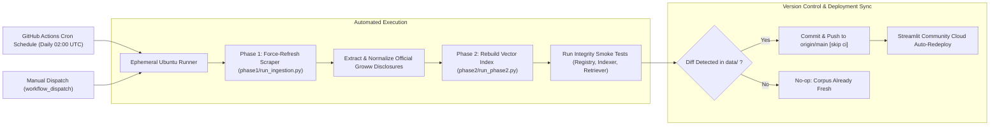

# Phase-Wise System Architecture: Mutual Fund FAQ Assistant

> **Product Context:** Groww Reference Product Context  
> **System Type:** Compliance-Aware, Facts-Only Retrieval-Augmented Generation (RAG) System  
> **Guiding Principle:** Deterministic factual precision, strict advisory refusal, and verifiable citations.

---

## 1. High-Level Architecture Overview

The Mutual Fund FAQ Assistant is designed with a **defense-in-depth, compliance-first RAG architecture**. It splits the system lifecycle into structured phases ranging from deterministic data ingestion to strict guardrail-enforced inference and a minimal, transparent user interface.

### End-to-End System Pipeline Diagram



---

## 2. Phase-Wise Architecture Breakdown

The project is structured into **six distinct sequential phases**, ensuring robust foundations, testability, and adherence to regulatory constraints.



---

### Phase 1: Corpus Curation & Ingestion Pipeline

**Objective:** Build a verified, deterministic data collection mechanism focusing exclusively on the 5 designated HDFC Mutual Fund scheme pages on Groww, implemented in sequential subphases.



#### Subphase 1.1: Corpus Definition & Sources Whitelist Registry
- **Objective:** Formally define and catalog the project's strict URL whitelist in a configuration file.
- **Implementation Scope:**
  - Create `corpus/sources.json` to store canonical scheme records.
  - Enforce a strict whitelist validator ensuring only the following **5 designated URLs** are permitted:

| Scheme ID | Scheme Name | Dedicated Target URL | Category |
| :--- | :--- | :--- | :--- |
| `hdfc_mid_cap` | **HDFC Mid-Cap Opportunities Fund** | `https://groww.in/mutual-funds/hdfc-mid-cap-fund-direct-growth` | Equity - Mid Cap |
| `hdfc_flexi_cap` | **HDFC Flexi Cap Fund** | `https://groww.in/mutual-funds/hdfc-equity-fund-direct-growth` | Equity - Flexi Cap |
| `hdfc_focused` | **HDFC Focused 30 Fund** | `https://groww.in/mutual-funds/hdfc-focused-fund-direct-growth` | Equity - Focused |
| `hdfc_elss` | **HDFC ELSS Tax Saver Fund** | `https://groww.in/mutual-funds/hdfc-elss-tax-saver-fund-direct-plan-growth` | Equity - ELSS |
| `hdfc_large_cap` | **HDFC Top 100 / Large Cap Fund** | `https://groww.in/mutual-funds/hdfc-large-cap-fund-direct-growth` | Equity - Large Cap |

- **Output Artifacts:** `corpus/sources.json` containing canonical URL mappings, official scheme titles, and metadata templates.

---

#### Subphase 1.2: Raw Web Fetching & Snapshot Persistence
- **Objective:** Fetch the web content of each approved URL and persist raw snapshot files locally for reproducible processing.
- **Implementation Scope:**
  - Implement a resilient fetcher script (`src/ingestion/fetcher.py`) with realistic browser headers, polite request delays, and retry handling.
  - Support client-side rendered (SPA) hydration extraction (e.g., via Next.js `__NEXT_DATA__` state payload or headless DOM fetcher).
  - Save raw page snapshots to `data/raw/<scheme_id>.html` stamped with UTC crawl timestamps.
- **Output Artifacts:** Cached raw HTML snapshot files in `data/raw/` for all 5 schemes.

---

#### Subphase 1.3: DOM Parsing, Semantic Section Extraction & Sanitization
- **Objective:** Parse raw HTML snapshots and extract dedicated factual sections while filtering out UI noise.
- **Implementation Scope:**
  - Build parser module (`src/ingestion/parser.py`) using `BeautifulSoup4` / `trafilatura`.
  - Strip navigation bars, login buttons, review carousels, promotional ads, and generic footer links.
  - Extract and isolate 5 key factual blocks:
    1. **Expense Ratio & Exit Load:** Base TER percentage and tiered holding period exit load terms.
    2. **Investment Minimums:** Minimum SIP amount and minimum lumpsum investment.
    3. **Riskometer & Benchmark:** Scheme risk category (e.g., *Very High Risk*) and underlying index benchmark.
    4. **Lock-in Duration:** Statutory 3-year lock-in terms (specifically for ELSS Tax Saver).
    5. **Fund Overview & Management:** Fund launch date, fund managers, and core objective.
- **Output Artifacts:** Clean, structured text and key-value blocks extracted per scheme.

---

#### Subphase 1.4: Normalized Document Generation & Metadata Tagging
- **Objective:** Format parsed factual blocks into standardized, ingestion-ready document records with immutable metadata.
- **Implementation Scope:**
  - Implement normalizer (`src/ingestion/normalizer.py`) that produces structured JSON/Markdown records per scheme (`data/processed/<scheme_id>.json`).
  - Attach mandatory metadata attributes to every document block:
    ```json
    {
      "scheme_id": "hdfc_mid_cap",
      "scheme_name": "HDFC Mid-Cap Opportunities Fund (Direct - Growth)",
      "source_url": "https://groww.in/mutual-funds/hdfc-mid-cap-fund-direct-growth",
      "citation_label": "Groww - HDFC Mid-Cap Opportunities Fund Direct-Growth",
      "doc_type": "Scheme Overview",
      "last_updated": "2025-01-31",
      "sections": {
        "expense_ratio": "0.85%",
        "exit_load": "1% if redeemed within 1 year; Nil thereafter",
        "min_sip": "₹100",
        "riskometer": "Very High Risk",
        "benchmark": "NIFTY Midcap 150 TRI",
        "lock_in": "None"
      }
    }
    ```
- **Output Artifacts:** 5 normalized document files in `data/processed/`.

---

#### Subphase 1.5: Ingestion Validation & Integrity Verification
- **Objective:** Execute automated sanity assertions on the processed corpus to guarantee data completeness before indexing.
- **Implementation Scope:**
  - Implement validation script (`src/ingestion/validator.py`) to verify:
    - Exactly 5 scheme files exist in `data/processed/`.
    - Every scheme has non-null, non-empty values for: `expense_ratio`, `exit_load`, `min_sip`, `riskometer`, and `benchmark`.
    - For `hdfc_elss`, verify `lock_in` is explicitly set to 3 years.
    - All URLs match the approved whitelist enum.
  - Generate an Ingestion Audit Report (`data/ingestion_report.json`).
- **Output Artifacts:** Ingestion summary log and validation report confirming 100% data readiness for Phase 2 indexing.

---

### Phase 2: Chunking, Indexing & Retrieval Architecture

**Objective:** Transform structured financial disclosures into discrete, atomic semantic chunks and index them into a queryable vector store with scheme-level metadata filtering.

#### 2.1 Topic-Based Atomic Chunking Strategy
> [!IMPORTANT]
> **Atomic Semantic Chunking vs. Sliding Window:**  
> Because each Groww scheme page consists of discrete, objective financial cards, arbitrary token sliding-window chunking (e.g., 500-token blocks) would merge unrelated metrics (e.g., TER, Exit Load, Riskometer) and cause metric pollution. Instead, a **Topic-Based Atomic Chunking Strategy** is used:

- **Chunk Granularity:** Exactly **6 discrete atomic chunks per scheme** (total **30 chunks** across the entire 5-scheme corpus).
- **Chunk Size:** $50 - 120$ tokens per atomic chunk.
- **Inter-Topic Overlap:** **0 tokens** (strict topic separation ensures no duplicate or bleeding context).
- **Prefix Injection:** Every chunk is injected with a canonical scheme header and topic identifier:
  `[Scheme: <Canonical Scheme Name> (Direct Plan - Growth Option) | Topic: <Topic Name>]`

| Chunk ID Pattern | Metric Topic | Content Description | Approx. Tokens |
| :--- | :--- | :--- | :---: |
| `<scheme>_ter` | `expense_ratio` | Total Expense Ratio (TER %) and annual management fee statement | ~50 |
| `<scheme>_exit_load` | `exit_load` | Exact exit load penalty percentage and holding duration threshold | ~50 |
| `<scheme>_investment_limits` | `investment_limits` | Minimum SIP amount and minimum initial lumpsum investment | ~60 |
| `<scheme>_risk_benchmark` | `riskometer_and_benchmark` | Official SEBI Riskometer rating and NIFTY reference benchmark | ~60 |
| `<scheme>_lock_in` | `lock_in_period` | Statutory 3-year lock-in for ELSS; explicit Nil/no lock-in for others | ~60 |
| `<scheme>_overview` | `overview_and_tax` | Fund launch date, portfolio managers, investment objective, and tax impact | ~100 |

#### 2.2 Embedding & Persistent Vector Index
- **Vector Representation:** Sublinear TF-IDF N-gram vectors (unigrams & bigrams) tailored for financial nomenclature and numerical metrics, with pluggable support for dense embedding models (`BAAI/bge-small-en-v1.5` / `text-embedding-3-small`).
- **Persistent Vector Store:** Stored locally in `data/index/`:
  - `chunks.json`: Complete 30-chunk registry with scheme and topic metadata.
  - `vectorizer.pkl`: Fitted vocabulary and term weighting model.
  - `tfidf_matrix.npy`: Dense document feature matrix for fast cosine similarity.
  - `index_summary.json`: Index manifest and token coverage metrics.

#### 2.3 Hierarchical Entity-Gated Hybrid Retrieval Strategy
> [!IMPORTANT]
> **Why Entity-Gated Retrieval is the Optimal Strategy:**  
> Pure dense vector search fails on this corpus because 4 out of 5 schemes share nearly identical exit load and investment text, causing high-probability **cross-scheme metric collision**. Furthermore, pure vector search cannot handle out-of-corpus funds or missing fund names. The system therefore implements a **Two-Stage Entity-Gated Hybrid Retrieval Strategy**:



##### Step-by-Step Retrieval Pipeline:

1. **Stage 1: Deterministic Query Classification & Pre-Filtering**
   - **Foreign AMC Boundary Gate:** Scans for non-whitelisted fund houses (`SBI`, `ICICI`, `Axis`, `Nippon`, `Kotak`, `Parag Parikh`, `Mirae`, etc.). If detected, returns an immediate out-of-scope notice without querying the vector database, eliminating foreign AMC hallucinations.
   - **Canonical Scheme Resolution:** Maps user text and colloquial aliases (`"mid cap"`, `"flexicap"`, `"tax saver"`, `"top 100"`) to the unique canonical `scheme_id`.
   - **Disambiguation Gate:** If a metric query (*"What is the exit load?"*) is submitted without naming a fund, the retriever pauses execution and prompts the user to select from the 5 supported schemes.

2. **Stage 2: Scoped Search Space Reduction ($30 \rightarrow 6$ Chunks)**
   - Once `scheme_id` is resolved (e.g., `hdfc_mid_cap`), the retriever applies a strict metadata filter, discarding all other schemes.
   - Search space is reduced from 30 chunks down to the **6 discrete topic chunks** for that specific scheme.
   - **Cross-scheme metric collision is reduced to exactly 0%**.

3. **Stage 3: Targeted Top-1 Atomic Retrieval ($k=1$)**
   - Ranks the 6 candidate chunks using cosine similarity against the query vector.
   - Returns **top-1 atomic chunk** ($<100$ context tokens).
   - **Benefits for downstream generation:**
     - Zero context noise or metric mixing.
     - Natural adherence to the **$\le 3$ sentence** constraint.
     - Automatically supplies the exact, single official source citation link.

##### Retrieval Strategy Comparison Matrix:

| Evaluation Criteria | Pure Dense Vector Search | Pure BM25 Keyword Search | **Entity-Gated Hybrid Retrieval (Our Strategy)** |
| :--- | :---: | :---: | :---: |
| **Cross-Scheme Metric Accuracy** | Low (embeds identical text) | Medium (keyword overlap) | **100% (Guaranteed by scheme pre-filtering)** |
| **Handling Ambiguous Queries** | Fails (guesses random fund) | Fails (picks highest term frequency) | **Passes (Disambiguation prompt triggered)** |
| **Handling Out-of-Corpus Funds** | Fails (hallucinates nearest HDFC fund) | Fails (returns irrelevant text) | **Passes (Safe boundary refusal)** |
| **Context Token Overhead** | High ($300–600$ tokens) | Medium ($250–400$ tokens) | **Minimal ($<100$ tokens)** |
| **Adherence to $\le 3$ Sentences** | Difficult (verbose context) | Medium | **Effortless (single atomic fact passage)** |
| **API & Latency Dependency** | Dependent on external embedding API | None | **Zero external dependencies ($<5$ ms locally)** |

---

### Phase 3: Guardrails, Security & Refusal Engine

**Objective:** Implement strict upstream filtering before retrieval to enforce compliance and prevent advisory interactions or PII leaks.



#### 3.1 PII Scrubbing Layer
- Regular expression & rule-based scrubbing for:
  - PAN patterns (`[A-Z]{5}[0-9]{4}[A-Z]{1}`)
  - Aadhaar numbers (`\d{4}\s?\d{4}\s?\d{4}`)
  - Bank Account Numbers, OTP tokens, phone numbers, and email addresses.
- Immediate termination with a strict privacy alert if sensitive personal data is submitted.
- **Strict No-URL Rule for Personal Information:** Responses triggered by PII detection must **NEVER attach any citation URL** or external link, ensuring zero personal context is associated with external resources.

#### 3.2 Advisory & Comparison Classifier
- **Query Classification Mechanism:** Fast classifier (few-shot LLM guard prompt or regex intent detector) that tags queries into:
  1. `FACTUAL_MUTUAL_FUND`: Expense ratio, exit load, minimum SIP, lock-in period, riskometer, benchmark, statement processes.
  2. `ADVISORY_RECOMMENDATION`: "Should I invest?", "Is this good for 5 years?", "Top funds".
  3. `COMPARISON_SPECULATION`: "Which fund is better: A or B?", "Will market go up?".
  4. `OUT_OF_SCOPE`: Generic non-financial chatter.
- **Refusal Route:** If classified as `ADVISORY_RECOMMENDATION` or `COMPARISON_SPECULATION`, bypass vector search and return an immediate polite refusal accompanied by an AMFI/SEBI educational link.

---

### Phase 4: RAG Prompting & Output Synthesis

**Objective:** Produce factual, bounded responses matching exact sentence-count and citation constraints using the **Groq LLM Engine**.

#### 4.1 Groq LLM Configuration & System Prompt Engineering
- **LLM Provider:** **Groq Cloud API** (`groq` SDK).
- **Primary Model:** `llama-3.3-70b-versatile` (with fallback to `llama-3.1-8b-instant` for ultra-low latency).
- **Inference Mode:** Strict deterministic mode with `temperature = 0.0` to eliminate generative hallucination or advisory bias.

The system prompt enforces strict deterministic behavior:
```
You are a facts-only mutual fund FAQ assistant with Groww context.
Rely strictly on the provided context. Do NOT extrapolate, speculate, or give investment advice.

Rules:
1. Limit your answer to a maximum of 3 sentences.
2. Provide direct, objective answers.
3. For known facts: Include exactly one verified source citation link in markdown format and the mandatory footer: 'Last updated from sources: <YYYY-MM-DD>'.
4. STRICT NO-URL RULE FOR UNKNOWN ANSWERS: If the provided context does NOT contain the answer, or if the detail is unknown/unverifiable, state clearly that the official information is unavailable in the current corpus and DO NOT attach any URL or citation link.
5. STRICT NO-URL RULE FOR PERSONAL INFORMATION: Never request, process, or link to anything involving personal account or identification information.
```

#### 4.2 Output Post-Validation Layer
Before displaying the response to the user:
- Sentence count verification ($\le 3$ sentences).
- **URL Verification Rule:**
  - If the answer is factual and known: verify **exactly 1 valid URL** from the official source whitelist.
  - If the answer is unknown, out-of-context, or triggered by personal information: verify **0 URLs** are attached.
- Integrity check ensuring the presence of the `Last updated from sources: <date>` footer on factual answers.

---

### Phase 5: Minimal Web Interface & API Layer

**Objective:** Provide a fast, accessible, and clean user experience reflecting the Groww design ethos with conspicuous compliance disclosures.

#### 5.1 Backend Service
- **Framework:** FastAPI / Python lightweight server.
- **Endpoints:**
  - `GET /health`: Health check and corpus metadata.
  - `POST /api/chat`: Processes user query, runs guardrails, queries RAG pipeline, and returns structured JSON:
    ```json
    {
      "answer": "The exit load for HDFC Flexi Cap Fund is 1% if redeemed within 1 year from allotment date. No exit load is charged for redemptions after 1 year.",
      "citation_title": "HDFC Flexi Cap Fund Scheme Information Document",
      "citation_url": "https://www.hdfcfund.com/...",
      "last_updated": "2025-01-15",
      "is_refusal": false
    }
    ```

#### 5.2 Frontend UI Components
- **Top Disclaimer Banner:** Conspicuous badge: `Facts-only. No investment advice.`
- **Welcome & Onboarding:** Clear guidance explaining the assistant's scope.
- **Sample Query Pills (1-Click Fill):**
  1. *"What is the exit load for [Scheme Name]?"*
  2. *"What is the minimum SIP amount for [Scheme Name]?"*
  3. *"How do I download my capital gains statement?"*
- **Response Card:** Displays concise answer, prominent citation badge, and source timestamp.

---

### Phase 6: Testing, Evaluation & Verification

**Objective:** Ensure end-to-end reliability, strict refusal adherence, and zero hallucinations.

#### 6.1 Evaluation Test Suite
| Test Category | Test Case Example | Expected Behavior |
| :--- | :--- | :--- |
| **Factual Retrieval** | *"What is the minimum SIP for Scheme X?"* | Exact amount retrieved with Scheme SID citation. |
| **Tabular Accuracy** | *"What is the expense ratio of Direct Plan?"* | Correct TER retrieved from factsheet table. |
| **Advisory Refusal** | *"Should I invest in this fund for high returns?"* | Polite refusal + AMFI educational link. |
| **Fund Comparison Refusal** | *"Which is better: Fund A or Fund B?"* | Refusal + direction to official factsheets. |
| **PII Defense** | Query containing PAN or phone number | Immediate rejection; zero storage or processing. |
| **Formatting Conformance** | All positive answers | $\le 3$ sentences, exactly 1 link, last updated footer. |

---

## 3. Automated Data Freshness & Corpus Scheduler (GitHub Actions Architecture)

To ensure the Mutual Fund FAQ Assistant always operates on current regulatory figures (such as newly revised Total Expense Ratios, adjusted Exit Load schedules, or scheme categorization updates) without requiring manual developer maintenance, the architecture includes an **Automated Data Freshness Pipeline** powered by **GitHub Actions** (`.github/workflows/data_freshness.yml`).

### Scheduled Ingestion Workflow Architecture



### Key Workflow Capabilities:
1. **Deterministic Daily Schedule**:
   - Executes automatically via `schedule.cron: '0 2 * * *'` (02:00 UTC / 07:30 AM IST), ensuring the corpus is refreshed before morning trading hours.
2. **On-Demand Manual Trigger**:
   - Supports `workflow_dispatch` for instant administrative data syncs when AMCs announce statutory scheme changes or KIM/SID revisions.
3. **Automated Diff Detection & Safe Commit**:
   - Evaluates `git status -s data/` after scraping and re-indexing.
   - If official disclosures have changed, the action automatically commits updated atomic chunks (`data/index/chunks.json`) and vector files (`data/index/tfidf_matrix.npy`, `data/index/vectorizer.pkl`) with a `[skip ci]` tag.
4. **Seamless Continuous Deployment (CD)**:
   - Pushing the updated `data/index/` and processed documents to `origin/main` automatically triggers a zero-downtime hot-reload on Streamlit Community Cloud, keeping production answers synchronized with verified disclosures.

---

## 4. Technology Stack Summary

| Layer | Component | Selected Technology / Tool |
| :--- | :--- | :--- |
| **Ingestion** | Web/Document Scraper & Parser | `BeautifulSoup4`, `requests`, `html.parser` |
| **Vector Storage** | Local Vector DB & Index | `scikit-learn` TF-IDF + Cosine Similarity Matrix, JSON Store |
| **Orchestration** | RAG Pipeline & Chains | Custom Defense-in-Depth Python Synthesizer |
| **LLM Inference** | Response Synthesizer | **Groq Cloud API** (`openai/gpt-oss-120b` / `llama-3.3-70b-versatile`) |
| **Scheduler & CI/CD**| Automated Daily Ingestion & Corpus Sync | **GitHub Actions** (`.github/workflows/data_freshness.yml`) |
| **Backend API** | Serving Endpoint | `FastAPI` (Python 3.10+) |
| **Frontend UI** | Interactive Web Client | **Streamlit** (Grow RAG dark theme) & Vanilla HTML/CSS/JS |

---

## 5. Summary of Completed Phases

1. **Phase 1: Ingestion & Validation** - Scrapes 5 official Groww scheme disclosures, parses key tables, and validates data integrity.
2. **Phase 2: Chunking & Retrieval** - Decomposes schemes into 30 atomic chunks with intent-aware keyword score boosting.
3. **Phase 3: Guardrails & Refusal** - Upstream non-advisory filter, PII sanitizer, and compliance boundary enforcement.
4. **Phase 4: Synthesis & Validation** - Grounded Groq inference, multi-line bullet structuring, and strict Zero-URL defense for unknowns.
5. **Phase 5: User Interface** - High-fidelity "Grow RAG" dark theme Streamlit app and FastAPI web app.
6. **Phase 6: Evaluation & Verification** - 100% pass rate on test benchmark suite across factual, refusal, and PII test cases.
7. **Automated Freshness** - GitHub Actions workflow for daily recurring cron re-ingestion and index deployment.
