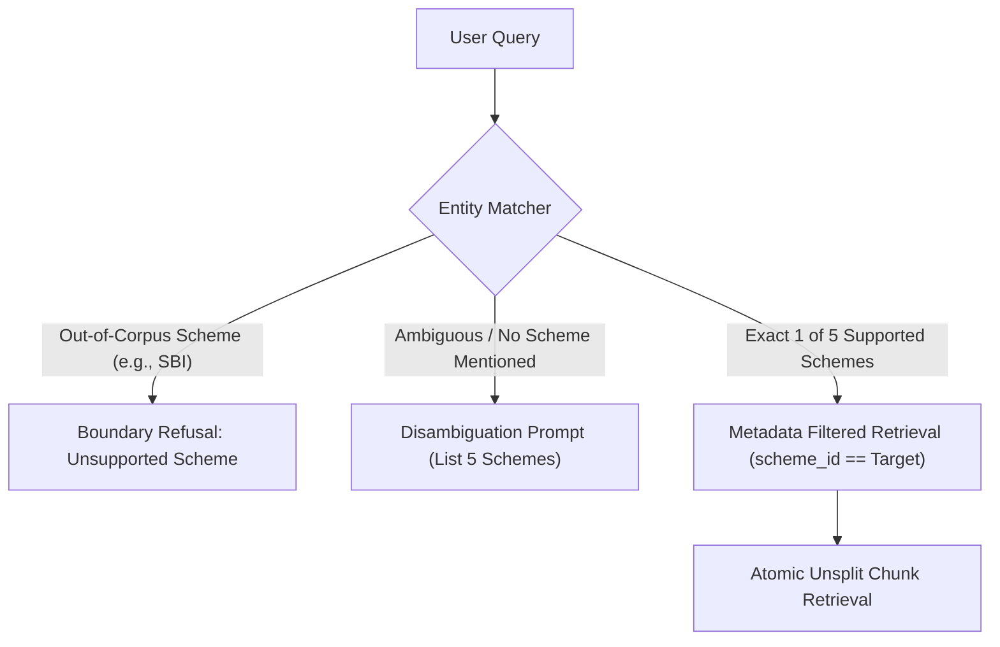

# Phase 2 Edge Cases: Chunking, Indexing & Vector Retrieval

> **Scope:** Semantic Chunking, Metadata Indexing, Scheme Disambiguation, and Vector/Hybrid Search across the 5 HDFC schemes.

---

## 1. Overview of Phase 2 Risks

Because all 5 schemes in the corpus share the same AMC (*HDFC*), similar document structures, and identical metric categories (*Expense Ratio, Exit Load, Benchmark, Riskometer*), naive vector search is prone to **cross-scheme metric collision** and **retrieval ambiguity**.

---

## 2. Detailed Edge Cases & Failure Modes

### Edge Case 2.1: Missing / Unspecified Scheme in User Query
- **Scenario:** User asks: *"What is the expense ratio?"* or *"What is the exit load?"* without specifying which of the 5 HDFC funds they are referring to.
- **Failure Mode:** Vector search retrieves arbitrary chunks from one of the 5 schemes based on slight syntactic similarities, giving a specific answer for the wrong fund without clarifying context.
- **Detection:** Scheme entity extractor detects 0 scheme mentions from the whitelist.
- **Mitigation Strategy:**
  - When no scheme is identified in an attribute-specific query, do not guess.
  - Return a disambiguation prompt listing the 5 supported schemes:
    > *"Please specify which HDFC scheme you are inquiring about: (1) Mid-Cap Opportunities, (2) Flexi Cap, (3) Focused 30, (4) ELSS Tax Saver, or (5) Top 100 / Large Cap."*

---

### Edge Case 2.2: Scheme Name Synonyms, Acronyms & Colloquial Aliases
- **Scenario:** User uses informal names or older scheme nomenclature:
  - *"HDFC Large Cap"* instead of *"HDFC Top 100"*
  - *"HDFC Equity Fund"* instead of *"HDFC Flexi Cap Fund"*
  - *"HDFC Tax Saver"* instead of *"HDFC ELSS Tax saver Fund"*
  - *"HDFC Focused"* instead of *"HDFC Focused 30 Fund"*
- **Failure Mode:** Keyword/vector matching fails to prioritize the correct scheme chunk, retrieving generic or incorrect fund passages.
- **Detection:** Entity resolution step checks against an explicit Scheme Alias Dictionary.
- **Mitigation Strategy:**
  - Build an explicit Canonical Scheme Alias Map:
    ```python
    SCHEME_ALIASES = {
        "hdfc_mid_cap": ["hdfc mid cap", "midcap", "hdfc mid-cap opportunities"],
        "hdfc_flexi_cap": ["hdfc flexi cap", "hdfc flexicap", "hdfc equity fund", "flexi cap"],
        "hdfc_focused": ["hdfc focused", "focused 30", "hdfc focused 30"],
        "hdfc_elss": ["hdfc elss", "tax saver", "hdfc taxsaver", "elss tax saver"],
        "hdfc_large_cap": ["hdfc large cap", "large cap fund", "top 100", "hdfc top 100"]
    }
    ```
  - Normalize user queries by injecting the canonical scheme name prior to vector search.

---

### Edge Case 2.3: Cross-Scheme Metric Collision (False Top-k Retrieval)
- **Scenario:** User asks: *"What is the exit load for HDFC Mid-Cap Opportunities Fund?"*. 
  The phrase *"Exit load is 1% if redeemed within 1 year"* is nearly identical across several equity funds.
- **Failure Mode:** The retriever ranks the exit load chunk of *HDFC Focused 30* higher than *HDFC Mid-Cap* because of minor embedding quirks.
- **Detection:** Retrieved top-1 chunk metadata `scheme_id` does not match the identified entity in the user query.
- **Mitigation Strategy:**
  - **Metadata Pre-Filtering:** Once a scheme entity is detected in the query, apply a strict metadata filter (`filter={"scheme_id": detected_scheme}`) in the vector database query.
  - **Context Prefix Injection:** Prepend `[Scheme: HDFC Mid-Cap Opportunities Fund]` to every chunk during ingestion so embeddings encode scheme identity strongly.

---

### Edge Case 2.4: Queries for Out-of-Corpus Schemes
- **Scenario:** User asks: *"What is the expense ratio of SBI Small Cap Fund?"* or *"What is the exit load for Parag Parikh Flexi Cap?"*.
- **Failure Mode:** Vector search finds the closest semantic match in the HDFC corpus and outputs an answer about an HDFC scheme, causing severe factual hallucination.
- **Detection:** User query mentions an asset manager or fund not present in the 5 supported HDFC URLs.
- **Mitigation Strategy:**
  - Pre-retrieval entity check flags foreign AMCs (*SBI, ICICI, Axis, Parag Parikh, Kotak, Nippon*).
  - Return an immediate boundary notice:
    > *"This assistant currently only covers 5 designated HDFC Mutual Fund schemes on Groww. Information for [Queried Scheme] is not available in our corpus."*

---

### Edge Case 2.5: Chunk Boundary Splitting of Tabular Details
- **Scenario:** An expense ratio table or tiered exit load schedule (e.g., *"0-12 months: 1%; 12-24 months: 0.5%; >24 months: Nil"*) is split across two separate chunks due to naive character-count chunking.
- **Failure Mode:** The model retrieves only one portion (e.g., only the ">24 months: Nil" line) and falsely tells the user there is no exit load.
- **Detection:** Chunks ending or starting in the middle of sentences, lists, or table rows.
- **Mitigation Strategy:**
  - Structure-aware chunking: chunk by DOM card or section boundary (`<div class="expense-ratio-card">`).
  - Never split financial metric cards across multiple chunks. Keep all load conditions together in a single atomic passage.

---

## 3. Retrieval Safeguards Summary


