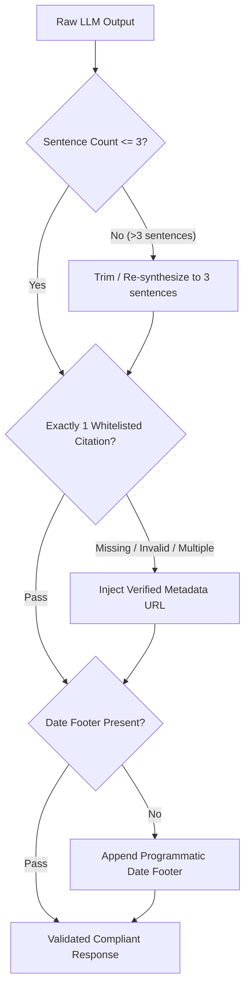

# Phase 4 Edge Cases: Synthesis & Formatting Constraints

> **Scope:** LLM Output Generation, Sentence Count Enforcement ($\le 3$), Citation URL Integrity, and Mandatory Footer Standardization.

---

## 1. Overview of Phase 4 Risks

The system prompt imposes rigid formatting constraints on every positive response:
1. **Maximum length:** $\le 3$ sentences.
2. **Citation count:** Exactly 1 official citation link from the approved URL whitelist.
3. **Mandatory footer:** `Last updated from sources: <YYYY-MM-DD>`.

LLMs naturally tend toward verbosity, hallucinating links, or omitting rigid footers unless deterministically controlled.

---

## 2. Detailed Edge Cases & Failure Modes

### Edge Case 4.1: Sentence Count Overflow (> 3 Sentences)
- **Scenario:** The LLM generates a helpful, detailed response that spans 4, 5, or more sentences (e.g., adding conversational intros like *"Thank you for your question. Here are the details you requested..."* followed by multi-clause paragraphs).
- **Failure Mode:** Violates the strict $\le 3$ sentence constraint mandated by the requirements.
- **Detection:** Algorithmic sentence splitter (e.g., `nltk.sent_tokenize` or regex sentence boundary detector) counts $>3$ sentences in the answer body.
- **Mitigation Strategy:**
  - **Prompt Engineering:** Strict prompt directive: *"Under no circumstances output more than 3 sentences in the answer body. Avoid greeting or conversational filler."*
  - **Deterministic Truncator / Summarizer:** If the generated answer exceeds 3 sentences, run a lightweight trimmer or regex truncation to keep only the first 3 complete, syntactically valid sentences before appending the citation and footer.

---

### Edge Case 4.2: Citation URL Hallucination or Formatting Drift
- **Scenario:** The LLM outputs a fabricated or broken link (e.g., `[Groww HDFC Fund](https://groww.in/funds/hdfc-midcap-fake-url)`), or links to a general homepage `https://hdfcfund.com` instead of the specific designated page.
- **Failure Mode:** Dead links, broken user experience, and failure of source traceability.
- **Detection:** Regex URL extractor checks the link against the strict whitelist of the 5 authorized Groww URLs.
- **Mitigation Strategy:**
  - **Programmatic Citation Injection:** Rather than asking the LLM to generate the URL string from memory, pass the exact canonical URL of the retrieved top chunk as a metadata parameter.
  - The synthesis orchestrator programmatically appends the verified citation:
    `Source: [HDFC Mid-Cap Opportunities Fund (Direct - Growth)](https://groww.in/mutual-funds/hdfc-mid-cap-fund-direct-growth)`

---

### Edge Case 4.3: Multiple Citations in a Single Response
- **Scenario:** When an answer uses information from two sections of the page, the LLM inserts multiple links:
  `Source 1: [Groww TER](url1), Source 2: [Groww Exit Load](url2)`.
- **Failure Mode:** Violates the "exactly one citation link" requirement.
- **Detection:** Count of markdown links (`\[.*?\]\(.*?\)` or `https?://`) $> 1$.
- **Mitigation Strategy:**
  - Enforce top-1 source deduplication. If multiple chunks from the same page are used, collapse them under the single parent scheme URL.
  - Post-processor regex removes any secondary links from the response text.

---

### Edge Case 4.4: Missing, Incomplete, or Future Timestamp in Footer
- **Scenario:** The LLM omits the footer entirely, hallucinates a future date (`Last updated: 2029-05-12`), or writes `Last updated: Recently`.
- **Failure Mode:** Failure of regulatory transparency and traceability requirements.
- **Detection:** Regex search for `^Last updated from sources: \d{4}-\d{2}-\d{2}$`.
- **Mitigation Strategy:**
  - Do not delegate footer date generation to the LLM.
  - The application layer automatically appends the deterministic metadata date extracted during Phase 1 ingestion:
    `\n\nLast updated from sources: {chunk.metadata['last_updated']}`

---

### Edge Case 4.5: Information Not Found in Corpus (Hallucination Prevention)
- **Scenario:** User asks for an obscure or unindexed metric for one of the 5 funds (e.g., *"Who is the legal custodian of HDFC Top 100?"* or *"What is the exact percentage holding in Infosys?"*).
- **Failure Mode:** Vector similarity retrieval returns the closest general text, and the LLM attempts to guess or extrapolate.
- **Detection:** Vector distance score exceeds threshold ($similarity < 0.65$), or LLM indicates uncertainty.
- **Mitigation Strategy:**
  - Grounding prompt instruction: *"If the retrieved context does not contain the answer, explicitly state that this specific detail is not available in the official scheme overview on Groww."*
  - Example safe fallback:
    > *"This specific detail is not available in the designated Groww scheme overview for HDFC Top 100 Fund. Please refer to the official scheme document for additional legal disclosures.*  
    > *Source: [HDFC Top 100 Fund](https://groww.in/mutual-funds/hdfc-large-cap-fund-direct-growth)*  
    > *Last updated from sources: 2025-01-31"*

---

## 3. Output Validation Pipeline

