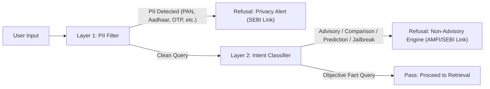

# Phase 3: Guardrails, Security & Refusal Engine

## 1. Overview
Phase 3 functions as the upstream security and compliance firewall of the Mutual Fund FAQ Assistant. Before any vector search or LLM generation occurs, the user query is evaluated to intercept sensitive personal identifiers (PII), advisory requests, subjective comparisons, speculative return calculations, and jailbreak attempts.

---

## 2. Guardrail Pipeline Architecture



---

## 3. Defense Layers

### 3.1 Layer 1: PII Scrubbing (`pii_filter.py`)
- Regex pattern matching for Indian financial and identity credentials:
  - **PAN:** `[A-Z]{5}[0-9]{4}[A-Z]{1}`
  - **Aadhaar:** 12-digit format with spaces/hyphens
  - **Phone:** Indian 10-digit mobile numbers
  - **Email:** Standard RFC-compliant email addresses
  - **OTP / PIN:** One-time passwords and authentication tokens
  - **Bank / Folio Numbers:** Sensitive account identifiers
- *Action:* Immediate security refusal; zero storage or downstream transmission.

### 3.2 Layer 2: Intent & Advisory Classifier (`intent_classifier.py`)
Categorizes incoming queries into:
- `ADVISORY`: Queries asking *"Should I invest?"*, *"Is this fund good?"*, *"Where should I invest ₹10,000?"*.
- `COMPARISON`: Queries asking *"Which fund is better?"*, *"Compare Fund A vs Fund B"*, *"Rank funds"*.
- `PREDICTION`: Future return or market forecasting queries (*"Will it give 20%?"*, *"Calculate SIP value"*).
- `JAILBREAK`: Prompt injection or roleplay attempts (*"Ignore instructions"*, *"Act as an advisor"*).
- `FACTUAL`: Legitimate mutual fund metric queries (TER, exit load, minimum SIP, riskometer, benchmark, lock-in).

### 3.3 Layer 3: Compliance Refusal Engine (`refusal_engine.py`)
Formats polite non-advisory refusal responses strictly adhering to regulatory guidelines:
- **Length Constraint:** $\le 3$ sentences.
- **Single Citation:** Direct link to [AMFI Investor Corner](https://www.amfiindia.com/investor-corner) or [SEBI Investor Portal](https://investor.sebi.gov.in).
- **Mandatory Footer:** `Last updated from sources: 2026-09-09`.

---

## 4. Usage Commands

Evaluate a query through the CLI:
```bash
python phase3/run_phase3.py --query "Should I invest in HDFC Mid Cap?"
```

Run automated test suite:
```bash
python phase3/test_guardrails.py
```
